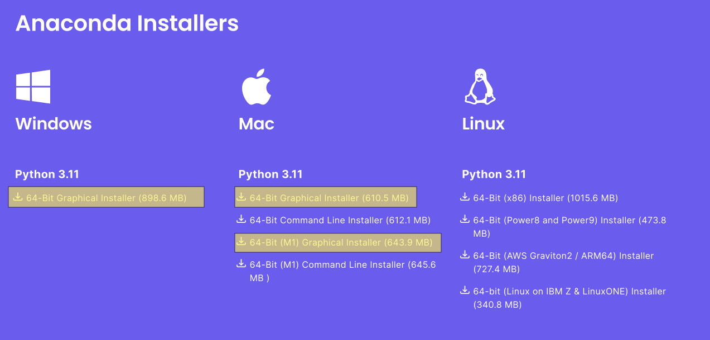

# HW0 Programming: Warm-up

:::info
Conceptual section due **Friday, February 03, 2023 at 6:00 PM EST**
Programming section due **Friday, February 03, 2023 at 6:00 PM EST**
:::

Welcome to the first (programming) assignment of CSCI1470/2470! This assignment will guide you through the creation of a local environment for the course and ensure that you will be all set to start on Homework 1. **This assignment will be graded for completion.**

## Theme

*An octopus doing assignment 0 (artist's rendition)*


# Getting started
Please click <ins>[here](https://classroom.github.com/a/w9rpAyb6)</ins> to get the stencil code. Reference this <ins>[guide](https://hackmd.io/gGOpcqoeTx-BOvLXQWRgQg)</ins> for more information about GitHub and GitHub Classroom.

# Roadmap
In order to complete (programming) assignments for this course, you will need a way to code, run, and debug your own Python code. While you are always free to use department machines for this (they have a pre-installed version of the course environment that every assignment has been tested against), you are also free to work on your own machines. 

Below we give you some information that is helpful for either of these situations.

## 1. Configuring Environment

### Developing Locally

In order to set up your virtual environment for this couse, we _highly recommend_ (and only formally support) the use of Anaconda to create and manage your Python environment. 

Once you have cloned the Github Classroom assignment for this assignment, you can do the following to setup your virtual environment:

1. Download the **Anaconda** installer from [here](https://www.anaconda.com/download#downloads), and install it on your computer. We recommend using the Graphical Installer for the correct system (Windows / (Intel) Mac / Mac M1). Pick the right one from one of these: 
    :::info
    **Note:** If you have an existing Anaconda or Miniconda installation (such as from CS200), then you don't need to reinstall, and can just use that!

    You can tell if you have an existing install if the command `conda --version` is recognized.
    :::
    :::warning
    **Windows**: When installing using the graphical installer, **be sure to check the box which adds `conda` to your `PATH`**.
    :::
2. Open a new terminal window and navigate to the root of the cloned assignment in a terminal (such as the one in VSCode) using `cd` and `ls`, and run `./env_setup/Other/conda_create.sh`. This should set up a virtual environment named `csci1470` on your computer. **If you have an Apple M1, this script will be different.** (See below.)

    :::info
    You may need to restart your terminal after installing Anaconda in order for this to work.
    :::
    :::warning
    **Note:** This might be slightly different depending on your platform:
    - **Apple M1**: We provide a slightly different script which you can call from `./env_setup/"Apple M1"/conda_create_m1.sh` for those who have Apple silicon. 
    - **Windows and Others**: If you are using Windows Powershell, then you can just run `./env_setup/Other/conda_create.sh` (forward slashes), but if you are using *Command Prompt*, then you need to run `.\env_setup\Other\conda_create.sh` (backslashes).
    
        **Some users have also experienced problems running the `*.sh` files entirely.** If this is the case, you can just open the `conda_create.sh` script in a text editor (such as VSCode), and run each line individually in your terminal.
    :::
3. Run `conda activate csci1470`. **You will need to do this in every shell where you want to use the virtual environment**.

:::warning
If you are the above procedure doesn't work for you (although we **highly recommend trying to troubleshoot that first**), here is another method that does not rely on `conda` commands:
:::spoiler
1. **Install Python 3.10** (or Python 3.9, we have not found any differences in functionality between them for our projects).
2. **Install the following packages** in either a virtual environment or your main python environment

        ipython==8.8.0
        matplotlib==3.5.3
        numpy==1.23.5
        Pillow==9.4.0
        scipy==1.9.3
        tensorflow==2.11.0
        tqdm==4.64.1

    - We suggest you create a virtual environment. You can do so by running the following commands:
        1. Create a folder where you plan to keep all your homework assignments.
        2. In that folder, run `python -m venv cs1470`. This will create a new virtual environment caled `cs1470`.
        3. Activate your virtual environment by running `cs1470/Scripts/activate` on Windows machines or `source cs1470/bin/activate` on Mac and Linux machines. Do this before starting any homework asssignment.
        4. You can deactivate the virtual environment by typing `deactivate`.
    - You can install individual packages using `pip` commands (ie `pip install ipython==8.8.0`)
    - You can install a group of packages by pasting them into a requirements.txt file and running `pip install -r requirements.txt`
:::

Once this is complete, you should have a local environment to use for the course!

### Department Machines

:::info
**Note:** Sometimes even if you set up your local environment correctly, you may experience unexpected bugs and errors that are unique to your local setup. To prevent this from hindering your ablity to complete assignments, we **highly recommend** that you familiarize yourself with the department machines, even if you expect to usually be working locally. 
:::

Department machines serve as a common, uniform way to work on and debug assignments. There are a variety of ways in which you can use department machines:

1. **In Person.** If you are in the CIT, you can (almost) always head into the Sunlab/[ETC] and work on a department machine.
2. **FastX**. FastX allows you to VNC into a department machine from your own computer, from anywhere! A detailed guide to getting FastX working on your own computer can be found [here](https://cs.brown.edu/about/system/connecting/fastx/).
3. **SSH**. The department machines can also be accessed by SSH (Secure Shell) from anywhere, which should allow you to perform command line activities (cloning repositories, running assignment code). You can check out an SSH guide [here](https://cs.brown.edu/about/system/connecting/ssh/).

When using the department machines, you can activate the course virtual environment (which we have already installed) using:

```
source /course/cs1470/cs1470_env/bin/activate
```

Which will activate the course virtual environment. From here, you should be able to clone the repository (see a GitHub guide here for more information on using Git via the command line), and work on your assignment.

:::info
**Note**: Python files using `tensorflow` may require a little more time on startup to run on department machines (likely because it is pulling files from the department filesystem), but they should all run nonetheless.
:::

## 2. Test your environment

### What is an environment?

Python packages, or libraries, are external sets of code written by other industry members which might prove really helpful! (Imagine coding how to draw a graph in Python every single time)

However, different classes, tasks, and even projects, might require different sets of Python packages. We can manage these as different virtual environments which have different sets of packages installed. 
### Conda Specifics

If you are using `conda`, you might notice the `(base)` prefix in your terminal. This signifies that you're in the default (hence `(base)`) environment.

To access CSCI1470's virtual environment, you can use `conda activate csci1470`. You should now see the `(csci1470)` prefix in your terminal!

To return back to the base environment, you can use `conda deactivate`. 
### Run Some Code :)

Once you have configured your virtual environment (either running on a department machine or , run the file `test_network.py` from the HW0 root directory by writing the following in your terminal:

```bash!
python3 code/test_network.py
```

This will run a simple neural network using TensorFlow and save the model to a file in the `models/` folder, which we will use to check that you have your local environment working properly.

## 3. README

For every assignment in this course, you will be required to submit a brief `README.md` file in your repository along with your code, explaining:

1. Any known bugs in your code, and how you have tried to fix them.
2. A brief explanation of your implementation. 
3. Answers to any questions in the programming part of the assignment (**excluding _Conceptual Questions_**).

For this assignment, **you should create a `README.md` file**, but since you didn't actually write any code for this assignment, feel free to either leave it blank or include a random message to the TAS :).

# Handing In
You should submit the assignment via Gradescope under the corresponding project assignment by zipping up your hw1 folder or through GitHub (recommended). To submit through GitHub, commit and push all changes to your repository to GitHub. You can do this by running the following three commands ([this](https://github.com/git-guides/#how-to-use-git) is a good resource for learning more about them):

1. `git add file1 file2 file3`
    - Alternatively, `git add -A` will stage all changed files for you. 
3. `git commit -m “commit message”`
4. `git push`
 
After committing and pushing your changes to your repo (which you can check online if you're unsure if it worked), you can now just upload the repo to Gradescope! If you’re testing out code on multiple branches, you have the option to pick whichever one you want. 


# Conclusion

Wohoo! You just completed your first assignment of CSCI1470/2470! :tada: :octopus: :tada: 

::: success
Just like how you are set up an environment to do your assignments, octopi like to set up territory in coastal marine waters, staying in small crevices in rocks and coral.
:::

Now that your virtual environment is setup, you should be ready to do the rest of the assignments in this course.


